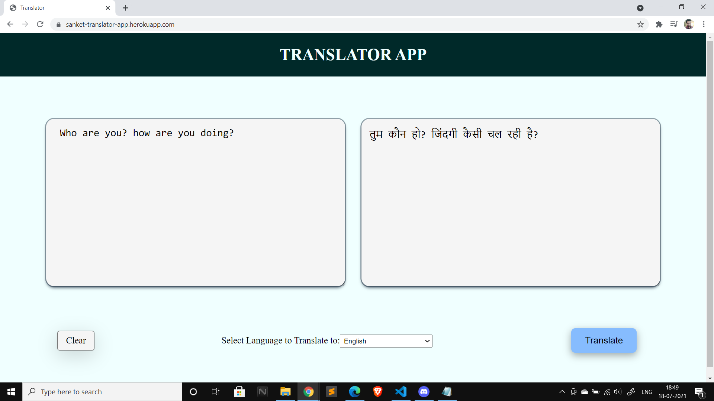
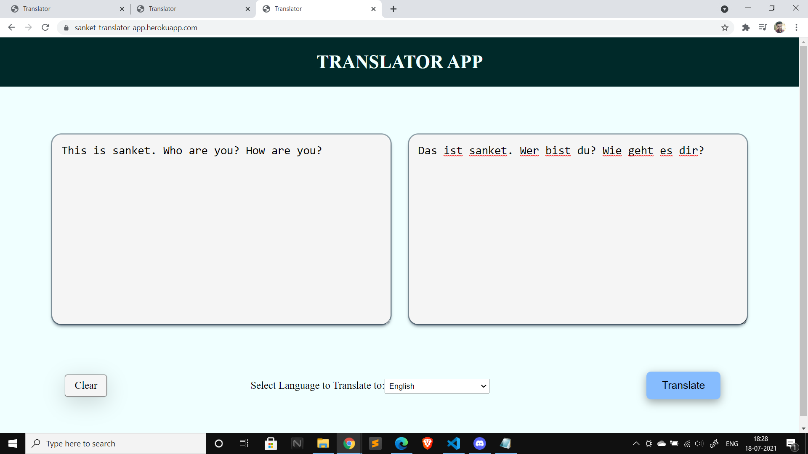
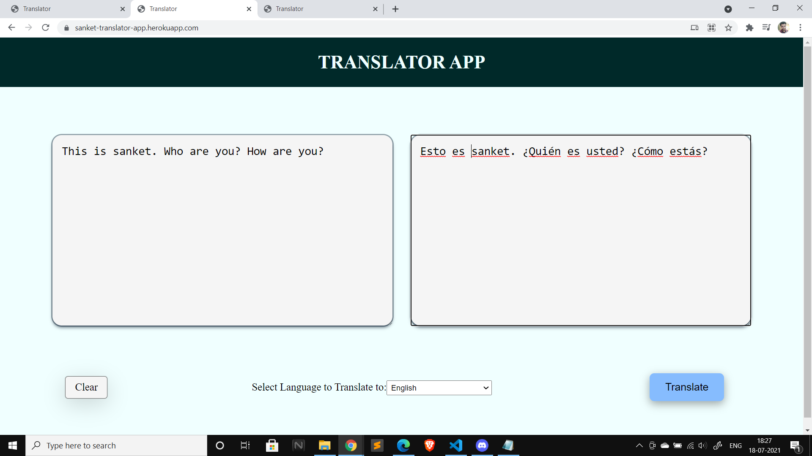

# Translator-App

A Translator App - [Visit App](https://sanket-translator-app.herokuapp.com/)

## Features

- Auto language detection
- Spelling correction
- Language correction
- Fast and reliable – it uses the same servers that [translate.google.com](https://translate.google.com) uses

## About The Project

An Express app that translates between languages. The Google translate Api is used for the translation which auto corrects the text and also detects the input language.

## English to Hindi



## English to German



## English to Spanish



### Built With

This section should list any major frameworks that you built your project using. Leave any add-ons/plugins for the acknowledgements section. Here are a few examples.

- [Express](https://expressjs.com/)
- [Nodejs](https://nodejs.org/en/)
- [Pug](https://pugjs.org/api/getting-started.html)
- [API](https://www.npmjs.com/package/@vitalets/google-translate-api)

## Getting Started

### Prerequisites

Make sure you have node.js installed and have npm. If not Download node.js from [here](https://nodejs.org/en/download/).

To get latest npm version use:

```sh
npm install npm@latest -g
```

## How to use?

1. Clone the repo
   ```sh
   git clone https://github.com/sanketchaudhari10/Translator-App.git
   ```
2. Install NPM packages
   ```sh
   npm install
   ```
3. To run the server, make sure you are in the root directory then
   ```
   node app.js
   or
   npm run start
   ```
